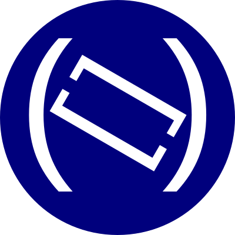

# d8ndl.org

## Dayton Dynamic Languages 

Exploring the craft of programming in a variety of modern languages!

Python, Perl, Ruby, JavaScript, PHP, etc...  

## What we are 

A group of programmers, from novice to expert, who meet 
to learn together about techniques, technologies, and 
languages. 

"Dynamic languages" are a family of high-level interpreted 
programming languages.  Truth is, we are a little broader than 
that and sometimes 
try out languages that aren't technically dynamic... but 
they're always *interesting!*  We're a highly interactive 
group - we experiment, ask each other questions, and play 
with things until they break in interesting ways.  We get 
insights that we can use no matter what language we're working 
in.

We are a special interest group (SIG) of the Dayton Microcomputer 
Association.

## What do we do?

- Explore a principle of programming that's relevant across languages 
- Try out an intriguing package or library
- Delve into a class of application
- Try out a programming language none of us knows 

## Monthly meetings 

We meet the 2nd Wednesday of every month, 7 - 9 PM, upstairs 
at Brixx Ice House.  Your topic suggestions are welcome!

## PyFri@WBI 

We hold an informal Python Learners' Meetup on Fridays at noon at 
Wright Brothers' Institute on Springfield Street (near the 
Air Force museum).  

## Find out more! 

Check d8n.org and sign up for our mailing list!

Also see the DMA's meetup page at 
https://www.meetup.com/Dayton-Microcomputer-Association-Meetup
for meeting specifics.

